# 📘 Laboratório AWS – Aplicação Serverless CRUD com DynamoDB e Python

## 📌 Visão Geral

Este laboratório descreve, de forma **detalhada e prática**, a criação de uma aplicação **serverless** na AWS utilizando os seguintes serviços:

* **Amazon DynamoDB** – Banco de dados NoSQL
* **AWS Lambda** – Backend em Python (CRUD)
* **Amazon API Gateway (HTTP API)** – Exposição dos endpoints
* **Amazon S3** – Hospedagem do frontend estático
* **Amazon CloudWatch** – Monitoramento e logs

O objetivo é construir uma **aplicação web de cadastro de produtos**, integrando frontend e backend totalmente na nuvem.

---

## 🎯 Objetivos do Laboratório

Ao final deste laboratório, você será capaz de:

* Criar e configurar uma **Role IAM** para o Lambda
* Criar uma **tabela no DynamoDB**
* Desenvolver e implantar uma **função Lambda em Python**
* Configurar **rotas HTTP no API Gateway**
* Hospedar um **site estático no S3**
* Configurar **logs e monitoramento no CloudWatch**
* Testar a aplicação ponta a ponta
* Realizar a **limpeza dos recursos** para evitar custos

---

## 🧩 Arquitetura da Solução

```text
Usuário (Browser)
   ↓
Amazon S3 (Frontend)
   ↓
Amazon API Gateway (HTTP API)
   ↓
AWS Lambda (Python)
   ↓
Amazon DynamoDB
```

---

## 📋 Pré-requisitos

* Conta AWS ativa (permissões administrativas)
* Conhecimentos básicos em Cloud Computing
* Noções de Python, HTML, CSS e JavaScript
* Navegador atualizado

---

## 🔐 Passo 1 – Criação da Role IAM

### 🎯 Objetivo

Permitir que a função Lambda acesse o DynamoDB e escreva logs no CloudWatch.

### 📌 Procedimento

1. Acesse **IAM > Roles > Criar perfil**
2. Tipo de entidade confiável: **Serviço da AWS**
3. Caso de uso: **Lambda**
4. Policies adicionadas:

   * `AWSLambdaBasicExecutionRole`
   * `AmazonDynamoDBFullAccess`
5. Nome da role:

   ```text
   RoleCrud-seunome
   ```
Passo a passo

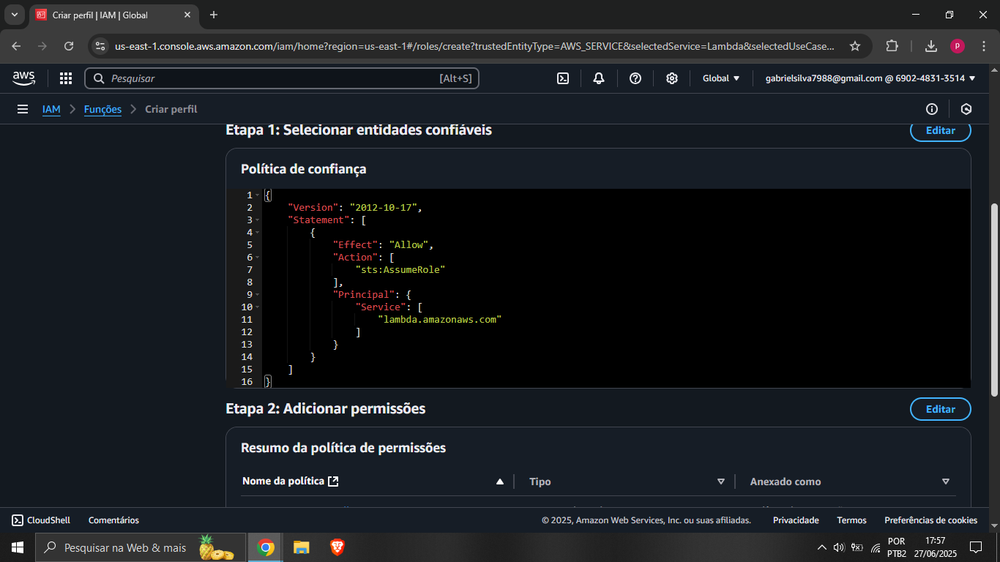
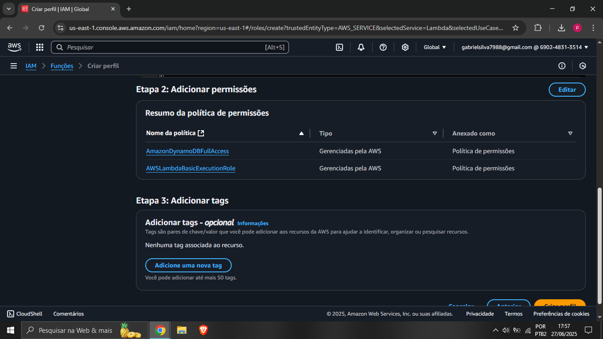

---

## 🗄️ Passo 2 – Criação da Tabela DynamoDB

### 🎯 Objetivo

Armazenar os produtos cadastrados na aplicação.

### 📌 Configurações

* **Nome da tabela:**

  ```text
  Produtos-seunome
  ```
* **Chave de partição:**

  ```text
  id (String)
  ```

> ⚠️ Guarde o nome da tabela, ele será usado no código Python.

Prints
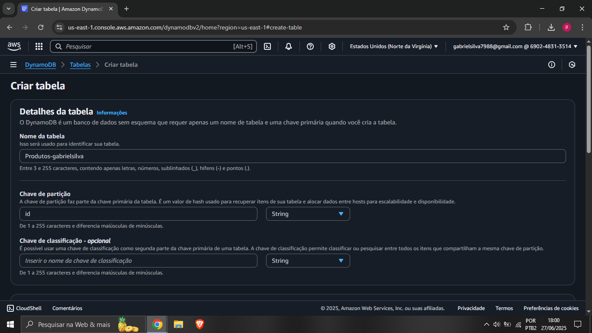
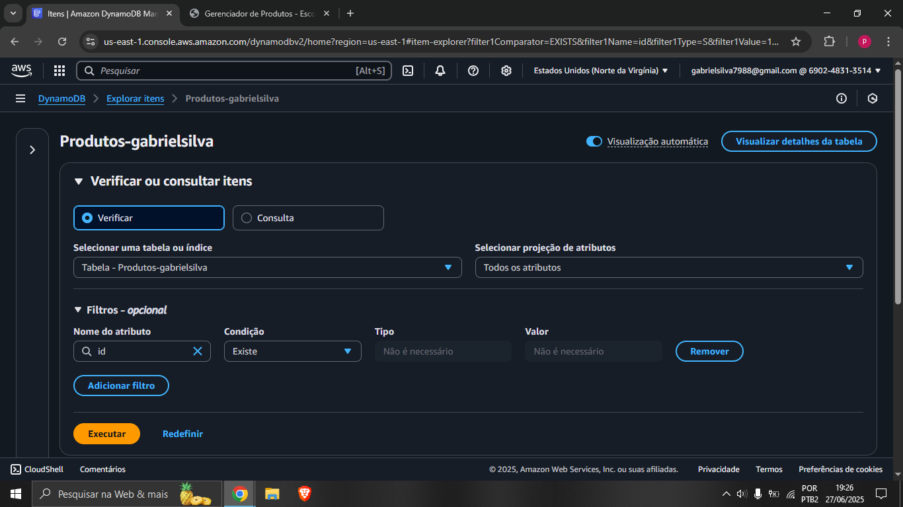
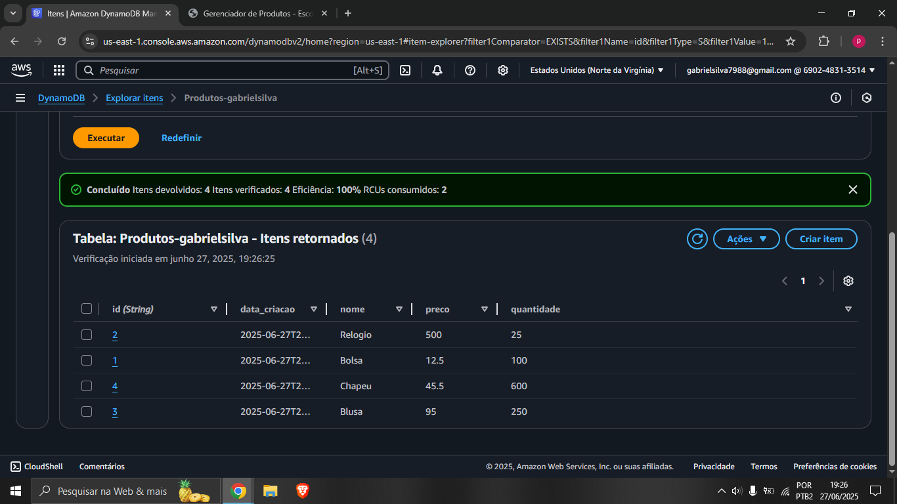


---

## 🧠 Passo 3 – Criação da Função Lambda (Python)

### 🎯 Objetivo

Implementar as operações **CRUD** (Create, Read, Update, Delete).

### 📌 Configurações principais

* Nome da função:

  ```text
  LambdaCrud-seunome
  ```
* Runtime: **Python 3.12**
* Role: `RoleCrud-seunome`
* Memória: **256 MB**
* Timeout: **10 segundos**

---

### 🧩 Código Python – Lambda (CRUD)

> 🔽 **Basta enviar esse codigo zipado para o Lambda**

```python
import json
import boto3
from decimal import Decimal
from datetime import datetime

dynamodb = boto3.resource('dynamodb')
table = dynamodb.Table('<Sua tabela Dynamondb>')

def convert_decimals(obj):
    if isinstance(obj, Decimal):
        return float(obj)
    if isinstance(obj, dict):
        return {k: convert_decimals(v) for k, v in obj.items()}
    if isinstance(obj, list):
        return [convert_decimals(v) for v in obj]
    return obj

def respond(status_code, body):
    return {
        'statusCode': status_code,
        'headers': {
            'Content-Type': 'application/json',
            'Access-Control-Allow-Origin': '*',
            'Access-Control-Allow-Methods': 'GET,POST,PUT,DELETE,OPTIONS',
            'Access-Control-Allow-Headers': '*'
        },
        'body': json.dumps(convert_decimals(body), default=str)
    }

def lambda_handler(event, context):
    http_method = event['requestContext']['http']['method']
    path = event['rawPath'].replace('/prod', '', 1)
    
    # OPTIONS (CORS preflight)
    if http_method == 'OPTIONS':
        return respond(200, {})

    # POST /produtos
    if http_method == 'POST' and path == '/produtos':
        body = json.loads(event.get('body') or '{}')
        for f in ('id','nome','preco','quantidade'):
            if f not in body:
                return respond(400, {'erro': f'{f} é obrigatório'})
        if table.get_item(Key={'id': body['id']}).get('Item'):
            return respond(409, {'erro': f"ID {body['id']} já existe"})
        item = {
            'id': body['id'],
            'nome': body['nome'],
            'preco': Decimal(str(body['preco'])),
            'quantidade': int(body['quantidade']),
            'data_criacao': datetime.utcnow().isoformat()
        }
        table.put_item(Item=item)
        return respond(201, {'mensagem':'Produto criado','dados':item})

    # GET /produtos
    if http_method == 'GET' and path == '/produtos':
        resp = table.scan()
        return respond(200, {'produtos': resp.get('Items', [])})

    # GET /produtos/{id}
    if http_method == 'GET' and path.startswith('/produtos/'):
        pid = event['pathParameters']['id']
        resp = table.get_item(Key={'id': pid})
        if 'Item' not in resp:
            return respond(404, {'erro':'Produto não encontrado'})
        return respond(200, resp['Item'])

    # PUT /produtos/{id}
    if http_method == 'PUT' and path.startswith('/produtos/'):
        pid = event['pathParameters']['id']
        body = json.loads(event.get('body') or '{}')
        upds, vals = [], {}
        for k,v in body.items():
            if k in ('nome','preco','quantidade'):
                upds.append(f"{k}=:{k}")
                vals[f":{k}"] = Decimal(str(v)) if k=='preco' else (int(v) if k=='quantidade' else v)
        if not upds:
            return respond(400, {'erro':'Nenhum campo válido para atualizar'})
        resp = table.update_item(
            Key={'id': pid},
            UpdateExpression='SET ' + ','.join(upds),
            ExpressionAttributeValues=vals,
            ReturnValues='ALL_NEW'
        )
        return respond(200, resp['Attributes'])

    # DELETE /produtos/{id}
    if http_method == 'DELETE' and path.startswith('/produtos/'):
        pid = event['pathParameters']['id']
        table.delete_item(Key={'id': pid})
        return respond(200, {'mensagem':'Produto excluído'})

    return respond(400, {'erro':'Método ou rota não suportada'})
```
Prints


---

## 🌐 Passo 4 – Criação do API Gateway

### 🎯 Objetivo

Expor a função Lambda via HTTP.

### 📌 Configurações

* Tipo de API: **HTTP API**
* Nome:

  ```text
  APICRUD-seunome
  ```
* Integração: **LambdaCrud-seunome**
* Stage:

  ```text
  prod
  ```

### 📍 Rotas HTTP

| Método | Caminho   |
| ------ | --------- |
| GET    | /produtos |
| POST   | /produtos |
| PUT    | /produtos |
| DELETE | /produtos |

Prints


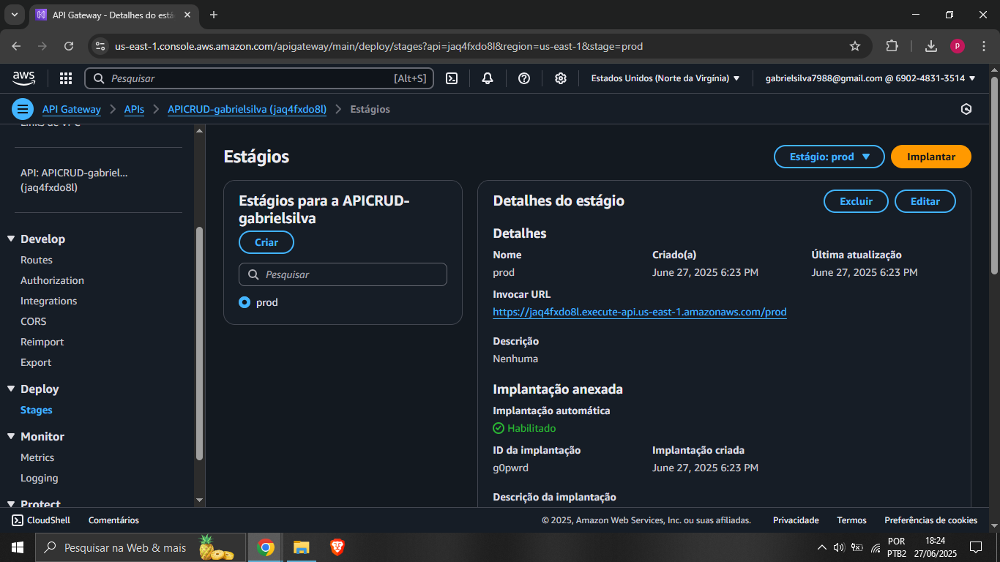

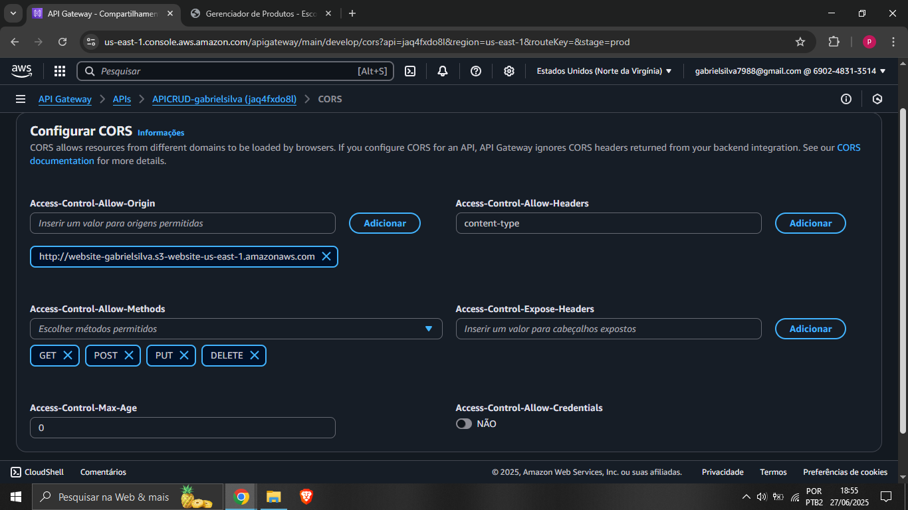
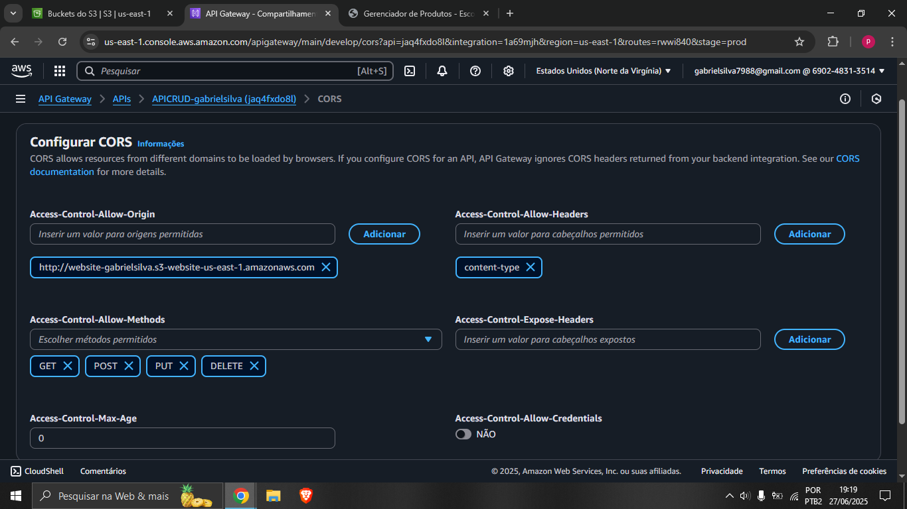

---

## 🎨 Passo 5 – Frontend (HTML, CSS e JavaScript)

### 🎯 Objetivo

Criar a interface web para interação com a API.

---

### 📄 HTML – Estrutura da Página

```html
<!DOCTYPE html>
<html lang="pt-BR">
<head>
  <meta charset="UTF-8">
  <meta name="viewport" content="width=device-width, initial-scale=1.0">
  <title>Gerenciador de Produtos - Escola da Nuvem</title>
  <link rel="stylesheet" href="style.css">
</head>
<body>
  <div class="container">
    <h1>Gerenciador de Produtos</h1>
    
    <div class="form-section">
      <h2>Cadastrar Novo Produto</h2>
      <div class="form-group">
        <input type="text" id="produtoId" placeholder="ID do Produto">
      </div>
      <div class="form-group">
        <input type="text" id="produtoNome" placeholder="Nome do Produto">
      </div>
      <div class="form-group">
        <input type="number" id="produtoPreco" placeholder="Preço" step="0.01">
      </div>
      <div class="form-group">
        <input type="number" id="produtoQuantidade" placeholder="Quantidade">
      </div>
      <button onclick="cadastrarProduto()">Cadastrar</button>
    </div>

    <div class="search-container">
      <input type="text" id="searchId" placeholder="Digite o ID do produto">
      <button onclick="buscarProduto()">Buscar</button>
      <button onclick="carregarProdutos()">Mostrar Todos</button>
    </div>

    <h2>Produtos Cadastrados</h2>
    <div class="table-container">
      <table>
        <thead>
          <tr>
            <th>ID</th>
            <th>Nome</th>
            <th>Preço</th>
            <th>Quantidade</th>
            <th>Ações</th>
          </tr>
        </thead>
        <tbody id="produtos-lista"></tbody>
      </table>
    </div>
  </div>

  <!-- Modal Overlay -->
  <div id="modal-overlay" class="modal-overlay hidden">
    <div class="modal">
      <h2 id="modal-title"></h2>
      <div class="modal-body"></div>
      <div class="modal-actions">
        <button id="modal-confirm-btn">Confirmar</button>
        <button id="modal-cancel-btn">Cancelar</button>
      </div>
    </div>
  </div>

  <footer class="footer">
    Desenvolvido por Escola da Nuvem &amp; Nome do Aluno
  </footer>

  <script src="script.js"></script>
</body>
</html>

```

---

### 🎨 CSS – Estilização

```css
:root {
  --dark-blue: #003366;
  --light-blue: #3399ff;
  --background-light: #e6f2ff;
}

body {
  font-family: Arial, sans-serif;
  margin: 0;
  padding: 20px;
  background-color: var(--background-light);
}

.container {
  max-width: 1000px;
  margin: 0 auto;
  background-color: white;
  padding: 20px;
  border-radius: 8px;
  box-shadow: 0 0 10px rgba(0,0,0,0.1);
}

h1, h2 {
  color: var(--dark-blue);
}

.form-section {
  margin-bottom: 20px;
  padding: 15px;
  background-color: #f9f9f9;
  border-radius: 5px;
}

.form-group {
  margin-bottom: 10px;
}

.form-group input {
  width: 100%;
  padding: 8px;
  border: 1px solid #ddd;
  border-radius: 4px;
}

button {
  padding: 8px 15px;
  background-color: var(--light-blue);
  color: white;
  border: none;
  border-radius: 4px;
  cursor: pointer;
  margin-right: 5px;
}

button:hover {
  background-color: var(--dark-blue);
}

.search-container {
  margin: 20px 0;
}

.search-container input {
  padding: 8px;
  width: 200px;
  margin-right: 5px;
}

.table-container {
  overflow-x: auto;
}

table {
  width: 100%;
  border-collapse: collapse;
  margin-top: 20px;
}

th, td {
  padding: 12px;
  text-align: left;
  border-bottom: 1px solid #ddd;
}

th {
  background-color: var(--light-blue);
  color: white;
}

tr:hover {
  background-color: #f5f5f5;
}

.mensagem {
  position: fixed;
  top: 20px;
  left: 50%;
  transform: translateX(-50%);
  padding: 10px 20px;
  border-radius: 4px;
  z-index: 1000;
}

.sucesso {
  background-color: #d4edda;
  color: #155724;
  border: 1px solid #c3e6cb;
}

.erro {
  background-color: #f8d7da;
  color: #721c24;
  border: 1px solid #f5c6cb;
}

/* Styles para Modal */
.hidden {
  display: none !important;
}
.modal-overlay {
  position: fixed;
  top: 0;
  left: 0;
  width: 100%;
  height: 100%;
  background: rgba(0,0,0,0.5);
  display: flex;
  align-items: center;
  justify-content: center;
  z-index: 2000;
}
.modal {
  background: white;
  padding: 20px;
  border-radius: 8px;
  max-width: 400px;
  width: 90%;
  box-shadow: 0 2px 10px rgba(0,0,0,0.2);
}
.modal-body {
  margin: 15px 0;
}
.modal-body .form-group {
  margin-bottom: 10px;
}
.modal-body .form-group input {
  width: 100%;
  padding: 8px;
  border: 1px solid #ddd;
  border-radius: 4px;
}
.modal-actions {
  text-align: right;
}
.modal-actions button {
  padding: 8px 12px;
  margin-left: 8px;
  border: none;
  border-radius: 4px;
  cursor: pointer;
}
.modal-actions #modal-confirm-btn {
  background-color: var(--light-blue);
  color: white;
}
.modal-actions #modal-cancel-btn {
  background-color: #ccc;
  color: #333;
}
.modal-actions #modal-confirm-btn:hover {
  background-color: var(--dark-blue);
}
.modal-actions #modal-cancel-btn:hover {
  background-color: #b3b3b3;
}

/* Footer */
.footer {
  text-align: center;
  padding: 15px 0;
  background-color: var(--dark-blue);
  color: white;
  margin-top: 30px;
  font-size: 0.9rem;
}

```

---

### ⚙️ JavaScript – Integração com API Gateway

> ⚠️ Lembre-se de inserir a URL do API Gateway na variável `API_URL`

```const API_URL = '<LINK SEU API GATEWAY>/produtos';
let produtosCache = [];

// Elementos do modal
const overlay = document.getElementById('modal-overlay');
const modalTitle = document.getElementById('modal-title');
const modalBody = document.querySelector('.modal-body');
const btnConfirm = document.getElementById('modal-confirm-btn');
const btnCancel = document.getElementById('modal-cancel-btn');

btnCancel.addEventListener('click', () => hideModal());

function showModal(title, bodyHTML, onConfirm) {
  modalTitle.textContent = title;
  modalBody.innerHTML = bodyHTML;
  btnConfirm.onclick = () => { onConfirm(); hideModal(); };
  overlay.classList.remove('hidden');
}

function hideModal() {
  overlay.classList.add('hidden');
  modalBody.innerHTML = '';
}

// Carrega todos os produtos
async function carregarProdutos() {
  try {
    const resp = await fetch(API_URL);
    if (!resp.ok) throw new Error('Erro ao carregar produtos');
    const data = await resp.json();
    produtosCache = Array.isArray(data) ? data : (data.produtos || []);

    const tbody = document.getElementById('produtos-lista');
    if (produtosCache.length === 0) {
      tbody.innerHTML = '<tr><td colspan="5">Nenhum produto cadastrado</td></tr>';
      return;
    }
    tbody.innerHTML = produtosCache.map(p => `
      <tr>
        <td>${p.id}</td>
        <td>${p.nome}</td>
        <td>R$ ${parseFloat(p.preco).toFixed(2)}</td>
        <td>${p.quantidade}</td>
        <td>
          <button class="btn-action" data-id="${p.id}" data-action="edit">Editar</button>
          <button class="btn-action" data-id="${p.id}" data-action="delete">Excluir</button>
        </td>
      </tr>
    `).join('');

    // Vincula eventos de editar/excluir
    tbody.querySelectorAll('.btn-action').forEach(btn => {
      btn.addEventListener('click', () => {
        const prod = produtosCache.find(x => x.id === btn.dataset.id);
        if (btn.dataset.action === 'edit') showEditModal(prod);
        else showDeleteModal(prod);
      });
    });

  } catch (e) {
    console.error(e);
    alert('Erro ao carregar produtos');
  }
}

// Modal de edição
function showEditModal(produto) {
  const bodyHTML = `
    <div class="form-group">
      <label>ID</label>
      <input type="text" id="edit-id" value="${produto.id}" readonly>
    </div>
    <div class="form-group">
      <label>Nome</label>
      <input type="text" id="edit-nome" value="${produto.nome}">
    </div>
    <div class="form-group">
      <label>Preço</label>
      <input type="number" step="0.01" id="edit-preco" value="${produto.preco}">
    </div>
    <div class="form-group">
      <label>Quantidade</label>
      <input type="number" id="edit-quantidade" value="${produto.quantidade}">
    </div>
  `;
  showModal(`Editar Produto ${produto.id}`, bodyHTML, async () => {
    const updated = {
      nome: document.getElementById('edit-nome').value.trim(),
      preco: parseFloat(document.getElementById('edit-preco').value),
      quantidade: parseInt(document.getElementById('edit-quantidade').value)
    };
    await fetch(`${API_URL}/${produto.id}`, {
      method: 'PUT',
      headers: { 'Content-Type': 'application/json' },
      body: JSON.stringify(updated)
    });
    carregarProdutos();
  });
}

// Modal de exclusão
function showDeleteModal(produto) {
  const bodyHTML = `<p>Tem certeza que deseja excluir o produto <strong>${produto.id} – ${produto.nome}</strong>?</p>`;
  showModal('Confirmar Exclusão', bodyHTML, async () => {
    await fetch(`${API_URL}/${produto.id}`, { method: 'DELETE' });
    carregarProdutos();
  });
}

// Criar novo produto
async function cadastrarProduto() {
  const p = {
    id: document.getElementById('produtoId').value.trim(),
    nome: document.getElementById('produtoNome').value.trim(),
    preco: parseFloat(document.getElementById('produtoPreco').value),
    quantidade: parseInt(document.getElementById('produtoQuantidade').value)
  };
  if (!p.id || !p.nome) { alert('Preencha ID e Nome'); return; }
  try {
    const resp = await fetch(API_URL, {
      method: 'POST',
      headers: { 'Content-Type': 'application/json' },
      body: JSON.stringify(p)
    });
    if (resp.status === 409) { alert('ID já existe'); return; }
    if (!resp.ok) throw new Error();
    carregarProdutos();
  } catch (e) {
    console.error(e);
    alert('Erro ao cadastrar produto');
  }
}

// Buscar por ID (renderiza só o produto encontrado)
async function buscarProduto() {
  const id = document.getElementById('searchId').value.trim();
  if (!id) { alert('Digite um ID para buscar'); return; }
  try {
    const resp = await fetch(`${API_URL}/${id}`);
    if (resp.status === 404) { alert('Produto não encontrado'); return; }
    if (!resp.ok) throw new Error();
    const produto = await resp.json();
    const tbody = document.getElementById('produtos-lista');
    tbody.innerHTML = `
      <tr>
        <td>${produto.id}</td>
        <td>${produto.nome}</td>
        <td>R$ ${parseFloat(produto.preco).toFixed(2)}</td>
        <td>${produto.quantidade}</td>
        <td>
          <button class="btn-action" data-id="${produto.id}" data-action="edit">Editar</button>
          <button class="btn-action" data-id="${produto.id}" data-action="delete">Excluir</button>
        </td>
      </tr>
    `;
    // Vincula eventos no resultado único
    tbody.querySelectorAll('.btn-action').forEach(btn => {
      btn.addEventListener('click', () => {
        if (btn.dataset.action === 'edit') showEditModal(produto);
        else showDeleteModal(produto);
      });
    });
  } catch (e) {
    console.error(e);
    alert('Erro ao buscar produto');
  }
}

window.addEventListener('DOMContentLoaded', carregarProdutos);

```

---

## 🪣 Passo 6 – Hospedagem do Site no S3

### 🎯 Objetivo

Disponibilizar o frontend como site estático.

### 📌 Configurações

* Nome do bucket:

  ```text
  website-seunome
  ```
* Hospedagem de site estático: **Ativada**
* Documento de índice:

  ```text
  index.html
  ```
Prints


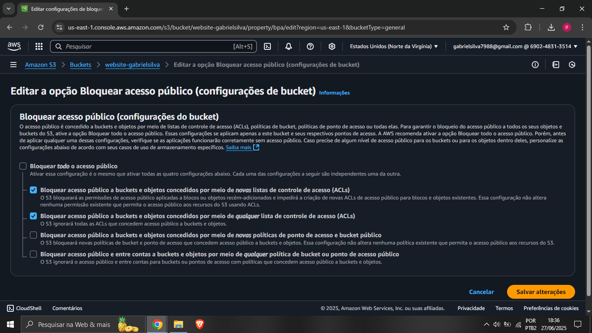
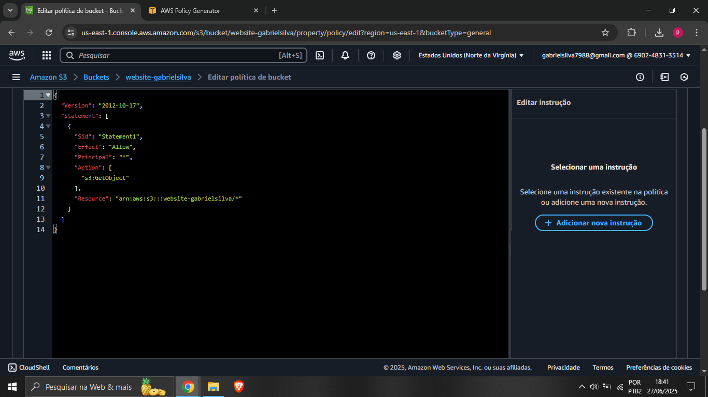

---

## 📊 Passo 7 – Logs e Monitoramento (CloudWatch)

### 🎯 Objetivo

Acompanhar requisições e execuções da aplicação.

### 📌 Grupos de Logs

* API Gateway:

  ```text
  APICRUD-seunome
  ```
* Lambda (automático):

  ```text
  /aws/lambda/LambdaCrud-seunome
  ```
Prints


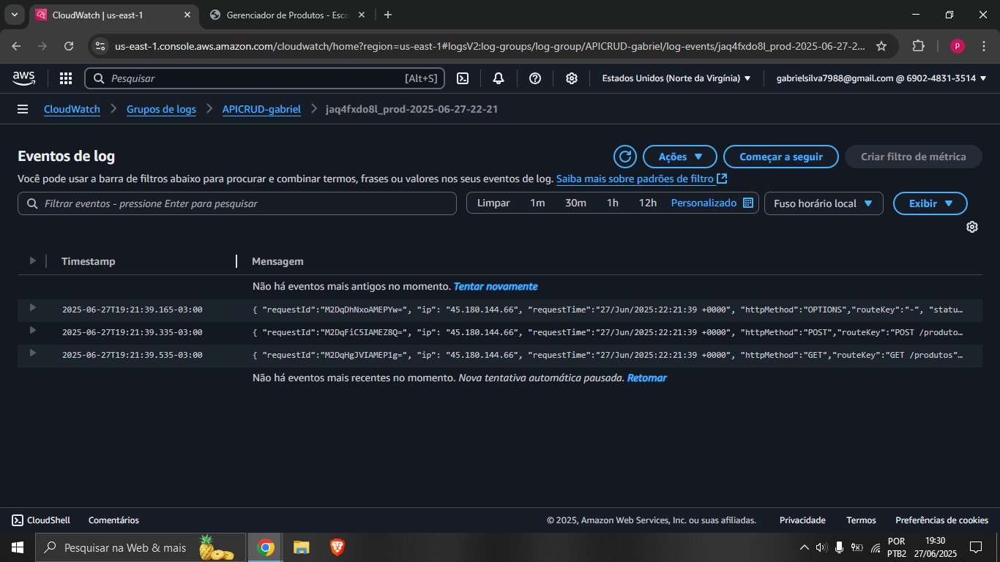

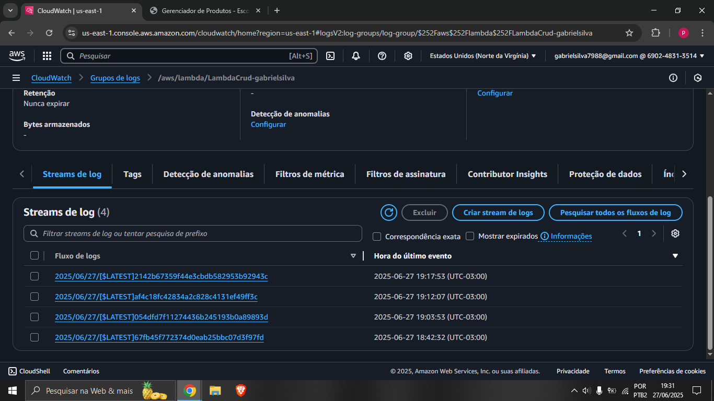
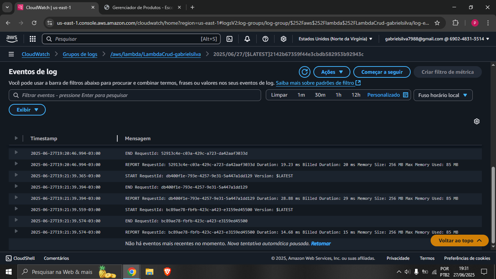
---

## 🧪 Passo 8 – Testes da Aplicação

### 📌 Cadastro de Produto (Exemplo)

```text
ID: 1
Nome: Bolsa
Preço: 12.50
Quantidade: 100
```

✔️ Verifique:

* Exibição no site
* Registro no DynamoDB
* Logs no CloudWatch

Prints
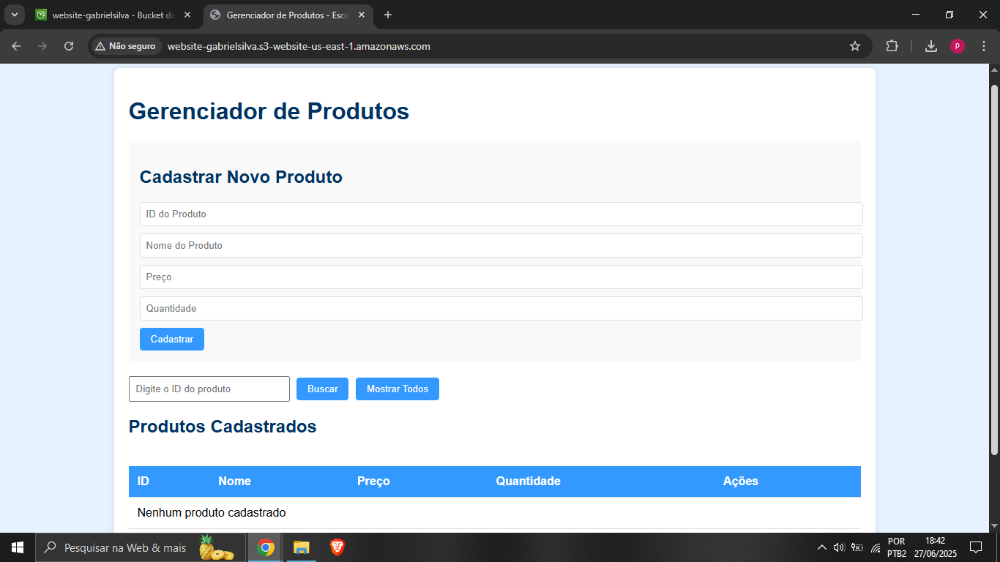


---

## 🧹 Passo 9 – Limpeza dos Recursos (IMPORTANTE)

### 🚨 Para evitar custos:

* Excluir:

  * DynamoDB
  * Lambda
  * API Gateway
  * Bucket S3
  * CloudWatch Logs
  * Role IAM

---

## ✅ Conclusão

🎉 **Parabéns!** Este laboratório cobre conceitos fundamentais exigidos para **Cloud Computing, DevOps e Arquitetura Serverless**, sendo extremamente relevante para ambientes profissionais e provas técnicas.

---

📌 *Documentação criada em formato Markdown para fácil estudo, versionamento e reutilização.*
